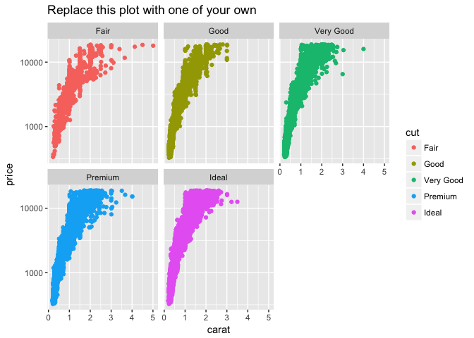

MATH 216 Data Science Final Project (Fall 2016)
================

-   Name: Yuchen Zhu
-   Project title: Segregated Public Schools in New York City
-   Write-up on RPubs: <http://rpubs.com/rudeboybert/Tree_Growth_Differences>
-   Abstract:

1.  rename columns in excel
